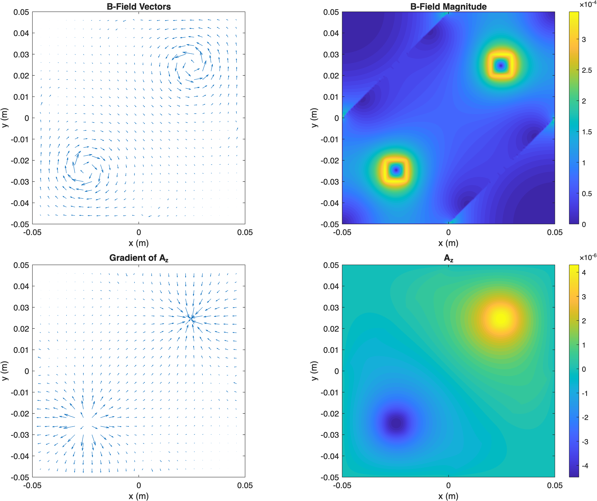
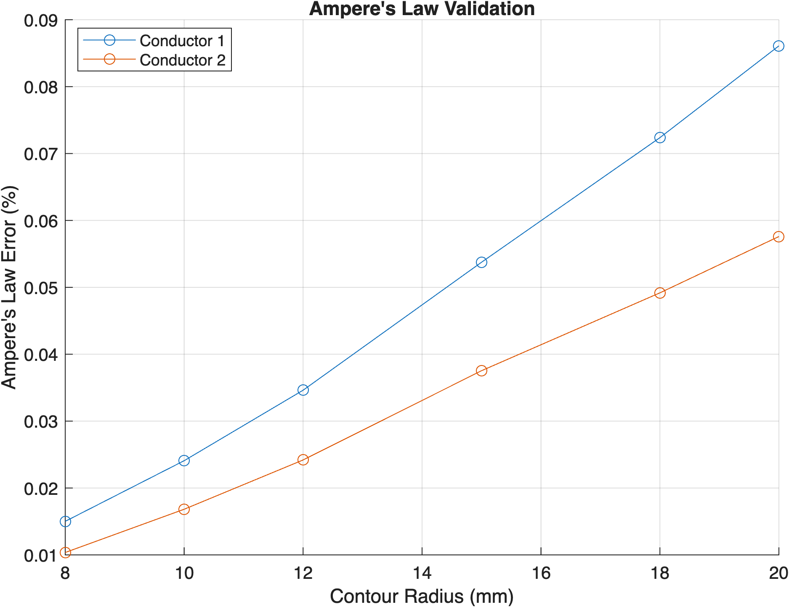

# 2D Magnetostatic Solver in MATLAB

This project implements a 2D magnetostatic field solver in MATLAB using finite differences and Gauss–Seidel iteration.

The model solves for the magnetic vector potential (A_z) over a rectangular grid containing current-carrying conductors and regions of different magnetic permeability. The magnetic flux density is calculated from

$$
B_x = \frac{\partial A_z}{\partial y}, \qquad
B_y = -\frac{\partial A_z}{\partial x}
$$

## Features

* Spatially varying magnetic permeability
* Magnetic field and vector potential visualization
* Ampère's law validation over multiple contours

## Numerical Solution

Magnetic flux density and magnetic vector potential calculated by the finite-difference solver.

## Validation

Ampère's law is checked by numerically evaluating

$$
\oint \mathbf{H}\cdot d\mathbf{l} = I_{\mathrm{enc}}
$$

around circular contours surrounding each conductor.

Ampère's law error across several integration contour radii.

## Running the Code

Run `magnetostatic_field_solver.m` in MATLAB. The script generates field plots and prints validation results to the command window.
